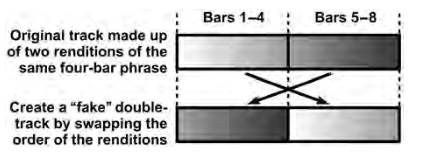

Mike Senior listening examples: [Chapter 18: Stereo Enhancements](https://cambridge-mt.com/ms/ch18/)

> “Modern mixing is all about being wide,” says Delbert Bowers, “with different styles requiring different types of width.”

## Arrangement Tweaks

One way to generate width without even using plugins is to create a fake double-track. It's best to do this by taking a section that repeats and using the repeated version of the section as the double track, so that your double isn't exactly the same.

Andy Wallace talks about using this technique regularly:

> “Normally I like to create [double-tracks] from the performances that are already there by taking the double from another moment in the song where the part is played, so I actually really get two different performances.”

Remember that if you just try to duplicate the same track it will cause serious phase cancellation issues in mono, and just not sound as interesting.

If you do need to use the same track, try to apply some sort of different processing settings to the double, so that it's not phase coherent.

Mike Senior also suggests using adding a wide synth pad or noise texture (tape hiss, vinyl noise, and Foley room tones).

> A pad will enrich pitched sustains, unpitched textures will to some extent improve perceived blend and obscure low-level details, and Foley ambiences may also clearly imply a sense of size and space.

## Adjusting Stereo Spread

Manipulating the stereo spread of a mix is easy with mono recordings. With stereo recordings, narrowing tracks is simple. The difficulty comes when one wants to widen a stereo track. We can have greater control over the width of stereo tracks using MS encoding.

From the book:

> one channel containing the mono elements at the center of the stereo image (the Middle signal) and one channel containing the elements that appear off-center (the Sides signal). As a sound moves off-center in a Middle and Sides (MS) recording, its level reduces in the Middle signal and increases in the Sides signal, its polarity in the Sides signal indicating which side of the stereo field it happens to be on. You can represent an identical stereo signal in both left–right and MS formats, and because each represents exactly the same information it’s easy to convert between them.

- An MS encoding plugin will give you the ability to adjust the stereo width by changing the level of the Sides signal.
- You can also use these plugins to reduce the level of the center, leaving space there for more important elements.

Other stereo tools:

- [Affordable Middle & Sides (MS) Plug-ins](https://cambridge-mt.com/ms/ch18/)

## Static Enhancements

### EQ based widening

### Comb Filtering

### Haas Delays

### Pitch Shifting

### A Classic Pitch-Shifted Delay Patch
