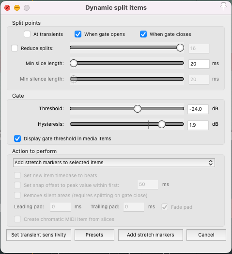
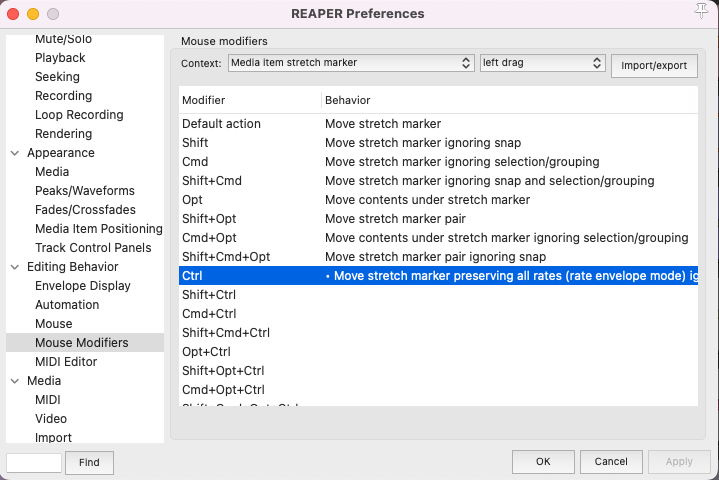

We'll be using Benjamin John's [Better Way](https://cambridge-mt.com/ms/mtk-newbies/#BenjaminJohn) to practice retuning vocals and and aligning background vocals. Download the shorter edit for use in class.

## Tuning vocals with ReaTune

Add the ReaTune plugin to the lead vocal track. The first step in the process is figuring out what key the song is in. One way to help with that is the tuner part of ReaTune. For most pop songs, it should be relatively simple to use the tuner to figure out the key.

Once you know the key, go to the correction tab and select that key. This will make it much easier to know which notes are out of tune and by how much.

Set the attack time to at least 50 ms. Any shorter and you'll sound like T-pain. Disable the stereo correction if the vocal is in mono.

Set the algorithm to _elastique 3.3.3 Pro_.

Now, go to the _manual correction tab_ and we can start to correct the pitch manually. We need to "capture" the vocals, so select _track pitch_ and play through the section you want to correct. It's good to start off with a complete melodic figure that is not too long.

Zoom into your captured vocals with the mouse wheel and cmd + mouse wheel.

To start the tuning process select the _Manual Correction_ option.

It is really helpful to have a keyboard, so that we can check which notes the melody is supposed to be. This is a bit of an art form, so we'll spend some time going through this melody and correcting where the notes look and sound off, making sure to not overcorrect.

## Vocal Alignment

This recording has a double tracked vocal. This second track has some timing variation that makes it sound a little off from the lead vocal.

> Based on [Align Vocal Tracks in REAPER - YouTube](https://www.youtube.com/watch?v=YoaBNqvCyCI)

If you don't know the song well, it can be helpful to add markers at every word, then write the word the vocalist is singing. This can help you recognize where there's a new word in the waveform, and what is just a longer held note of the same word.

It may also be helpful to increase the peak size (Peaks: Increase peaks display zoom for project) so that you can see the phrases more easily. You can do this with the _shift + up_ keys. Note that this doesn't change the level of the item.

Select all of the vocal tracks, except for the lead vocal then bring up _Dynamic Split_ (D).

Use the below settings:

The level difference between the transient and silence isn't great enough so that the transient detection works. Because of this we'll use _when gate opens_ and _when gate closes_ to put markers on the start and ends of the words. Add stretch makers to selected items and examine your tracks.

We'll now need to move, delete, or add stretch markers that are in the wrong place, extra, or needed.

## Moving, delete, add stretch markers

To move stretch markers, set your mouse modifier preferences like below:

To delete stretch makers select _option + click_ on the mac. To add a stretch marker _option + command_ on the mac.

To remove multiple markers at a time: select the item, make a time selection of the markers, then select:

Fix your stretch makers so that there is one at the beginning and ending of each word.

After editing group your vocals. Now you can move stretch markers of one of the vocals, and it will catch the others and make them align.

This is not an automatic process. It will take time and attention to detail to make it sound good.

> Continue with this process until vocals are tuned and aligned to the best of your ability.
