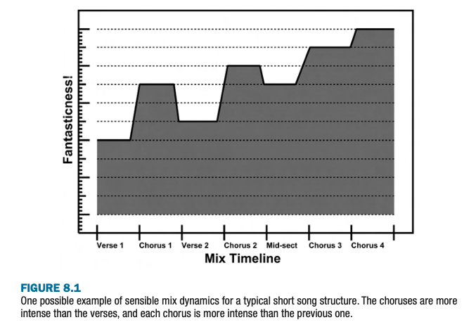

## Start with the most important section

What is the most important section of this song?

> “I’ll start with the louder or bigger section [with] the most instruments . . . the chorus typically, or maybe the bridge” says Neal Avron, for instance. “And then the rest of it is kind of ‘unbuilding’ for the verses and the intros.”

After we pick the most important section we'll start the mix there. From that point we can mix the other sections in relation to that one, making sure to leave the most important section the loudest and most upfront.

We might design the dynamic structure of a mix like this:

The chorus's are the most important parts so we mix all of those first.

## Start with the Most Important Instrument

Now that we've chosen the structure our mix will take, we have to find the most important instrument. What is that for this song? We'll bring up this fader first, then decide what else is important and go in that order. If we go in the correct order, we can avoid overprocessing when we try to squeeze instruments into a space.

Let's each of us in class write down a list of what we think the most important instruments are in order. We'll discuss why and try to stick to our plan.

## Simple Balancing Tasks

- high pass filtering
- panning mono recordings
  - hard panning or soft panning?
  - What should we just leave in the center?

## Setting the levels

We'll set the levels of our instruments with our faders, starting with the most important. After we're done we'll use a script to copy the values of the faders to our media item volumes. We do this so that we can use the faders later for automation or further mixing.

Be sure to switch speakers often to get a good idea of how the balance will sound on different systems and that you're not deceiving yourself. Take lots of breaks and vary your listening levels.

I'm aiming to have everything sounding balanced, while having the master track not go above -6 dB.
