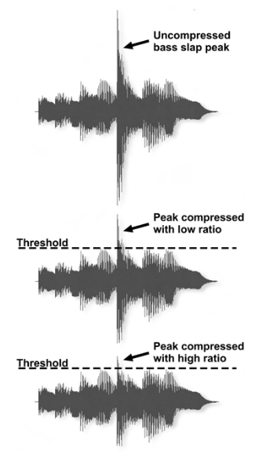

What about all of these other settings?!?!?

## Compression Ratio

This determines how much of an effect the compressor has on the signal once it reaches the threshold. Sort of like "how hard is this compressor working?". If you have a signal that is varying widely, you might want a higher ratio, but if you have a signal that only has a few out of balance parts, the ratio can be lower.

These settings can be demonstrated by changing the ratio then comparing the bounced waveforms.

Think about what you want to reduce in the signal and how intense it is. For a slap bass we can set a high ratio then set a threshold so that the compressor acts only on the peaks of the signal. We don't need to do any gain reduction because the signal is already pretty loud, but we can reduce the loudness of the peaks. I'll render the track so we can compare the waveform. The higher we go with the ratio the more these peaks will be reduced.

Now let's try it on an acoustic guitar. Set the threshold so that we are compressing most of the notes. Then we can go back to the ratio to get the desired result.

## Attack time and release time

> they determine how quickly the compressor’s gain reduction reacts to changes in the input signal level: the former specifies how fast the compressor can react in reducing gain, whereas the latter specifies how fast the gain-reduction resets.

If we want the compressor to move more slowly, to track longer-term level variations, we can make the attack and release times longer.

## Snare drum compression

From Mixing Secrets:

> - **Fast attack, fast release.** If you have a fast attack time, then the compressor will respond quickly to the fleeting initial drum transient, reducing the gain swiftly. If you then set the Release time very fast, the gain reduction will also reset very rapidly, well before the drum sound has finished, such that the lower-level tail of the drum hit won’t be compressed as much. Result: less drum transient.
> - **Fast attack, slow release.** Partnering your fast attack with a slower release will cause a rapid compression onset, but the gain-reduction will then reset very little during the drum hit itself, and mostly between the hits. The balance between the transient and sustain portions of the drum will therefore remain pretty much unchanged, and the compressor will primarily just make the level of each drum hit appear more consistent. Result: more consistent performance.
> - **Slow attack, slow release.** Increasing the attack time will allow some of each drum transient to sneak past the compressor before its gain reduction clamps down properly. This effectively increases the level difference between the transient and the rest of the snare sound. Result: less drum sustain. (It’s worth noting here that, although compression is normally associated with reducing dynamic range, in this case it might easily increase it.)

So we can get three different results: less transient, more consistent hit level, and less sustain.

## Parallel Compression

Increase sustain without affecting the transient. I'll try this on a drum loop I made.

We can add some intense compression to it. Parallel will let us keep some of this but also use the transient of the dry signal. Make another track and call it "Parallel Compression". Move the compressor over there.

To route the signal from our vocal to our new track just grab the route icon of the vocal drag it over the route icon for the compressor track. Make sure the fader is set to pre-fader so the fader does't affect the send level. We now have two faders, one with compressed and one with uncompressed signal. This allows us to mix the two signals together.

If we to do do this to multiple tracks we have to first create a buss. We can route our drums to the buss using the matrix view. Then we can route that bus to the compressor pre-fader.
